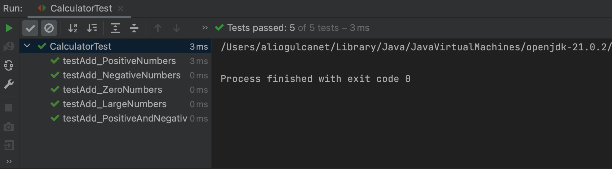

# Giris

Bu doküman, Özgür Yazılım A.S. için staj başvurum kapsamında, Java dilinde iki tam sayıyı toplayan bir fonksiyonun ve bu fonksiyon için yazılan birim testlerin detaylarını içermektedir.


# Fonksiyonun Tanımı

Aşağıdaki `Calculator` sınıfı içerisinde, iki tam sayıyı alan ve bu sayıların toplamını döndüren `sum` adında statik bir fonksiyon bulunmaktadır.

```java
public class Calculator {
    public static int sum(int number1, int number2) {
        return number1 + number2;
    }
}
```

## Teknik Seçimler ve Gerekçeleri

<b>Statik Metot Kullanımı:</b> Herhangi bir Calculator nesnesi oluşturmayacağımız için fonksiyonu statik oluşturdum. Bu sayede testler içerisinden fonksiyona sınıf üzerinden doğrudan erişebileceğiz.

<b>Veri Türü Seçimi:</b> Girdi ve çıktı olarak int veri türünü kullandım. Fonksiyon içerisinde tam sayılar ile işlem yapacağımız için çıktı olarak da tam sayı bekliyoruz.(Büyük sayılardaki overflow durumları hariç.)

### Birim Test Senaryoları ve Gerekçeleri

Öncelikle, testleri CalculatorTest adnda bir fonksiyonun içerisinde tanımladım. Bu sayede derleme süreci daha basitleşecek. 

Testleri JUnit kütüphanesini kullanarak gerçekleştirdim. Bunun sebebi öncelikle JUnitin en yaygın temel birim test çerçevesi olması ve kolay entegrasyona sahip olması ki bu sayede de CI/CD sürecinde testler daha az yükde çalışacağı için daha hızlı ve daha az hata ile çalışabilirler.

Aynı zamanda, test içerisinde assertion metodları yani beklenen ve gerçekleşen değerleri karşılaştıran metodları kullandım. Bunlar birim testlerin başlıca metodlarıdır.

# CalculatorTest Fonksiyonu ve Tüm Senaryolar


```java
import static org.junit.Assert.*;
import org.junit.Test;

public class CalculatorTest {

    @Test
    public void testAdd_PositiveNumbers() {
        assertEquals("10 + 20 should equal 30", 30, Calculator.sum(10, 20));
    }

    @Test
    public void testAdd_NegativeNumbers() {
        assertEquals("-10 + -20 should equal -30", -30, Calculator.sum(-10, -20));
    }

    @Test
    public void testAdd_PositiveAndNegativeNumbers() {
        assertEquals("-10 + 20 should equal 10", 10, Calculator.sum(-10, 20));
    }

    @Test
    public void testAdd_ZeroNumbers() {
        assertEquals("0 + 0 should equal 0", 0, Calculator.sum(0, 0));
    }

    @Test
    public void testAdd_LargeNumbers() {
        assertEquals("Max Integer + 1 should overflow and equal to Minimum Integer",
                Integer.MIN_VALUE, Calculator.sum(Integer.MAX_VALUE, 1));
    }

}
```


## testAdd_PositiveNumbers()

Bu method, iki pozitif tam sayının toplamının, yine bir pozitif tam sayıya eşit olduğunu test eder. Fonksiyonun başına `@Test` ile bir annotation belirterek, Javaya bu methodun bir test methodu olduğunu ve JUnit tarafından test sürecinde çağrılması gerektiğini belirttik.

assertEquals(), methodu ile birim testi gerçekleştiriyoruz. İlk parametre bir text içerir ve test sonucunda test ile ilgili bilgi vermek amacıyla kullanılır. İkinci parametrede beklenen değer ve üçüncü parametrede fonksiyonu çağırarak gerçek değeri alıyoruz. 

## testAdd_NegativeNumbers()

Buradaki testte ise iki negatif tam sayının toplamının yine bir negatif tam sayı olduğunu aynı teknikler ile test etmekteyiz.

## testAdd_PositiveAndNegativeNumbers()

Burada ise, bir pozitif tam sayı ve bir negatif tam sayının toplamını test ediyoruz. Buradaki amacımız fonksiyonunun işaret farklılıklarını algılayabilmesidir.

## testAdd_ZeroNumbers()

Burada, fonksiyon 0 değerlerini aldığında nasıl tepki verdiğini test ediyoruz.

## testAdd_LargeNumbers()

Burada daha farklı olarak, fonksiyonun overflow(taşma) durumunu test etmekteyiz. Eğer fonksiyon en büyük tam sayıyı bir parametre olarak alırsa, kesinlikle bir taşma gerçekleşecektir ve sonrasında fonksiyon küçük bir tam sayı döndürecektir.


# Testlerin Çalıstırılması

Testleri iki farklı yöntem ile çalıştırabiliriz.

## 1. Yöntem - Lokalde Çalıstırmak

Bu yöntem ile fonksiyon üzerinden hızlıca testleri çalıştırabiliriz bu sayede hızlı geribildirim alabiliriz. 

Tek yapmamız gereken, JUnit kütüphanesinin entegrasyonunu yapmaktır.


```java
<dependency>
    <groupId>junit</groupId>
    <artifactId>junit</artifactId>
    <version>4.12</version>
    <scope>test</scope>
</dependency>

```

CalculatorTest fonksiyonunu çalıstırdığımızda ise asağıdaki çıktıyı alıyoruz:




## 2. Yöntem - Docker Konteynırı Olusturarak CI/CD ile Testleri Otomatiklestirmek


Bir docker konteynırı ile testleri çalıstırmak, uygulamanın farklı ortamlarda özellikle canlıya alındığında tutarlı olarak çlaıştığından emin olmamızı sağlar. 

Öncelikle bir Dockerfile dosyası hazırlayacağız. Burada sanal bir bilgisayar oluşturuyoruz ve testler için tüm gereksinimleri bu bilgisayara yüklüyoruz:


```java
FROM maven:3.6-jdk-11 as build
WORKDIR /app
COPY . .
RUN mvn clean test
```

Burada javayı, jdk'yı ve maveni import ediyorsuz. Sonrasında testlerin bulunduğu dosyanın dizinini ayarlıyoruz ki konteynır burada çalışabilsin. Sonrasında bu dizindeki dosyaları alarak konteynıra kopyalıyoruz ve sonunda `RUN` komutu ile testleri çalıştırıyoruz.

Sonrasında bu dockerfile dosyasını build ederek konteynırımızı oluşturuyoruz:


```java
docker build -t ozgur_yazilim_test_konteynırı .
```

Konteynırı oluşturduktan sonra, Bu konteynırı CI/CD sürecine dahil edebiliriz ki bu sayede her kod değişikliğinde testlerin çalışmasını sağlarız. CI/CD süreci için Github Actions, Jenkins veya GitLab kullanılabilir. 


# Sonuç

Bu dokümanda, iki tam sayıyı toplayan basit bir Java fonksiyonu ve bu fonksiyon için yazılmış birim testlerin nasıl gerçekleştirileceğini, hangi tekniklerin neden ve nasıl kullanıldığı ve testlerin nasıl çalıştırılabileceğini anlattım. Okuduğunuz için teşekkür ederim.

Ali Oğulcan ET<br>
+90 (536) 656 1434<br>
ali_ogulcan06@hotmail.com
